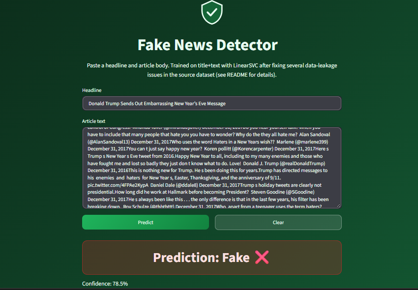

# Fake News Prediction

Rebuild of an earlier fake news classifier, delivered as a single Streamlit
app. The original version hit 99.4% test accuracy on a Decision Tree using
only author + title as features, on a single train/test split. That number
was a red flag, not a win, and this rebuild exists to find out why and fix
it properly.

**Live demo:** [https://fake-news-prediction-lufxg6hrappzrspbcyaygpc.streamlit.app/](https://fake-news-prediction-lufxg6hrappzrspbcyaygpc.streamlit.app/)



## Problem

Predict whether a news article is real or fake from its headline and body
text. Binary classification.

## Dataset

[Fake News detection dataset](about_dataset): `Fake.csv` (23,502 articles)
and `True.csv` (21,417 articles), 44,898 rows combined. Columns: `title`,
`text`, `subject`, `date`, `label` (1 = fake, 0 = real). No author column -
this is a different dataset from the original Kaggle version this project
started from, which had `id`/`title`/`author`/`text`/`label`.

## The overfitting problem, and what actually caused it

The original notebook's 99.4% accuracy came from training a Decision Tree
on `author + title` alone, evaluated on one train/test split. Specific
authors can correlate almost perfectly with real/fake in a given dataset
without that correlation meaning anything generalizable, and a single split
can't tell you if that's what happened. This dataset has no author column,
so the exact same leak can't recur, but the same category of leak can, and
it did: EDA and CV diagnostics on this dataset turned up four separate
issues, found one at a time as each fix exposed the next:

1. **`Subject` leaks perfectly.** Every subject value maps to exactly one
   label - `politicsNews` and `worldnews` are 100% real, `News`,
   `politics`, `left-news`, `Government News`, `US_News`, and `Middle-east`
   are 100% fake. Excluded from modeling entirely.
2. **Reuters dateline.** Real articles often open with a pattern like
   `WASHINGTON (Reuters) -`. 100% of rows with this dateline are real, but
   only 6.58% of rows *without* it are real. Left in, a model can shortcut
   on dateline presence instead of learning anything about content.
   Stripped before cleaning.
3. **Found via CV diagnostics, not EDA** - inspecting LinearSVC
   coefficients surfaced three more leaks EDA had missed: mid-article bare
   `Reuters` self-references (no parentheses, e.g. "Reuters reported in
   October..."), image-caption/URL/tweet-embed boilerplate (`via`,
   `Getty`, `pic.twitter.com`, `Featured image via...`), and 13.92%
   duplicate article bodies, skewed almost entirely fake (10,954 fake
   duplicates vs. 438 real). All three fixed: boilerplate stripped in
   `preprocess.py`, duplicates dropped before the train/test split.
4. **Residual, accepted rather than chased further:** `edt` (a timestamp
   abbreviation) still shows up as a weak real-news indicator after three
   rounds of fixes. Minor signal, documented here rather than spending
   more time hunting it down.

The lesson worth keeping: a single high accuracy number, especially on one
split, tells you almost nothing about whether a model generalizes. It took
inspecting model coefficients, not just class balance and missing values,
to find three of these four issues.

## Approach

1. **EDA** - class balance (52.3% fake / 47.7% real), missing values (none),
   and the `Subject`/dateline leakage checks above.
2. **Feature decision** - `title + text`, tested against `title` alone.
   `Subject` and `Date` excluded entirely (see leakage findings). Text
   cleaned with lowercasing, non-alphabetic stripping, stopword removal,
   and Porter stemming.
3. **Model comparison** - 5-fold stratified cross-validation, not a single
   split, comparing Logistic Regression, LinearSVC, and Random Forest, each
   with and without the text column, so the improvement from adding text
   over title-only is measured directly rather than assumed.
4. **Final fit and evaluation** - winning model refit on the full training
   split, then evaluated once against a holdout set that had never been
   touched by CV, training, or tuning.
5. **Deployment** - single Streamlit app, no separate backend/frontend
   split.

## Results

5-fold stratified CV (TF-IDF refit inside the CV loop per fold, not fit on
the whole dataset first, to avoid fold-vocabulary leakage into the scores):

| Variant    | Model              | Accuracy | F1     | Precision | Recall |
|------------|--------------------|---------:|-------:|----------:|-------:|
| title+text | **LinearSVC**      | **0.9831** | **0.9813** | 0.9850 | 0.9776 |
| title+text | Logistic Regression| 0.9758   | 0.9730 | 0.9810    | 0.9652 |
| title+text | Random Forest      | 0.9647   | 0.9605 | 0.9717    | 0.9495 |
| title only | LinearSVC          | 0.9385   | 0.9312 | 0.9406    | 0.9221 |
| title only | Logistic Regression| 0.9340   | 0.9254 | 0.9454    | 0.9062 |
| title only | Random Forest      | 0.9266   | 0.9166 | 0.9410    | 0.8935 |

`title+text` beats `title`-only by a real margin (98.31% vs. 93.85%
accuracy for LinearSVC), not noise. LinearSVC was selected: it wins every
metric except a tie on precision.

Final holdout evaluation (LinearSVC, refit on the full training split,
evaluated once against the 5,797-row holdout set - untouched since it was
set aside):

| Metric    | Value  |
|-----------|-------:|
| Accuracy  | 0.9874 |
| F1        | 0.9860 |
| Precision | 0.9874 |
| Recall    | 0.9847 |

The holdout numbers land close to the CV estimate rather than dropping
off, which is what you want to see - it means the CV score wasn't
optimistic, and the leakage fixes held up on data the model genuinely
never touched during model selection.

## Known limitations

- **`edt` residual signal.** A weak real-news indicator survives after
  three rounds of leakage fixes. See item 4 above.
- **Confidence is not a calibrated probability.** LinearSVC doesn't expose
  `predict_proba` without Platt scaling (`CalibratedClassifierCV`), which
  wasn't part of the CV comparison. The app's confidence bar is a sigmoid
  of the raw decision-function distance - useful as a rough signal of how
  far a prediction sits from the decision boundary, not a precise
  likelihood.
- **Free-tier cold starts.** Streamlit Community Cloud spins down inactive
  apps. The first load after a period of inactivity can take a few seconds
  to wake up - expected, not a bug.

## Architecture

One Streamlit app, not a separate API + frontend. `src/preprocess.py` and
`src/model.py` are plain Python, imported directly by
`app/streamlit_app.py` - no API layer in between, since this project has
no need for one and adding one would be complexity without payoff.

## Running locally

Requires [uv](https://docs.astral.sh/uv/).

```powershell
git clone https://github.com/<your-username>/fake-news-prediction.git
cd fake-news-prediction
uv sync

# one-time: train and save the model (uses data/content_cache.pkl if present)
uv run python -m src.model

# run the app
uv run streamlit run app/streamlit_app.py
```

App will be live at `http://localhost:8501`.

To reproduce the holdout evaluation:

```powershell
uv run python -m src.evaluate
```

## Tech stack

- **ML:** scikit-learn, pandas, nltk (stopwords, Porter stemming), joblib
- **App:** Streamlit
- **Dependency management:** uv
- **Deployment:** Streamlit Community Cloud